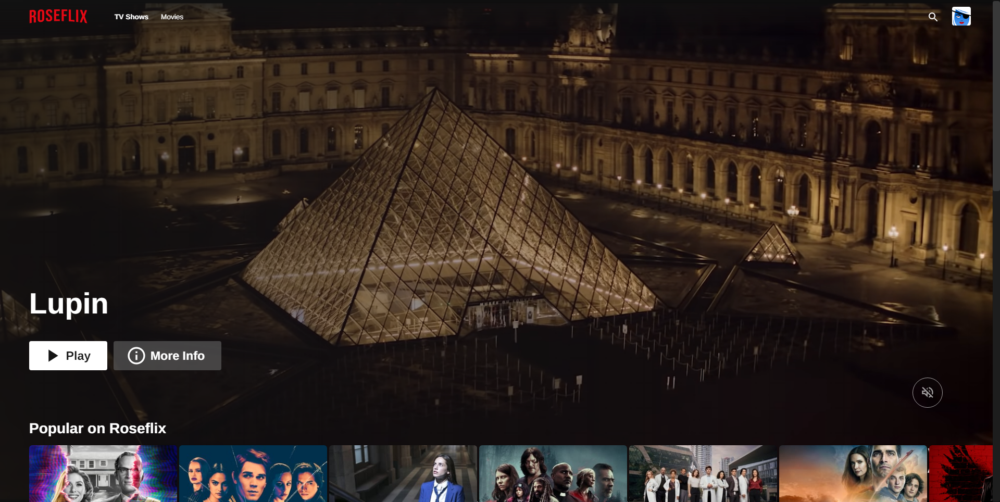
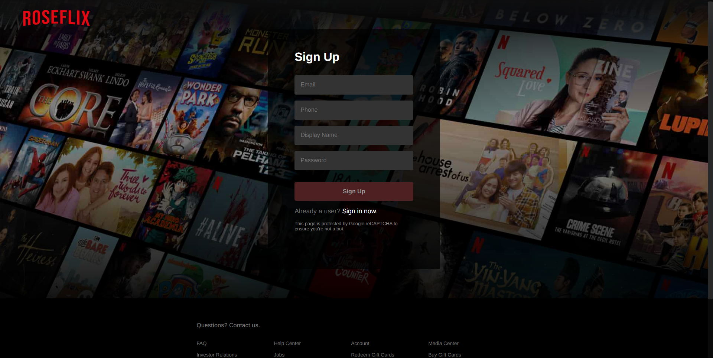
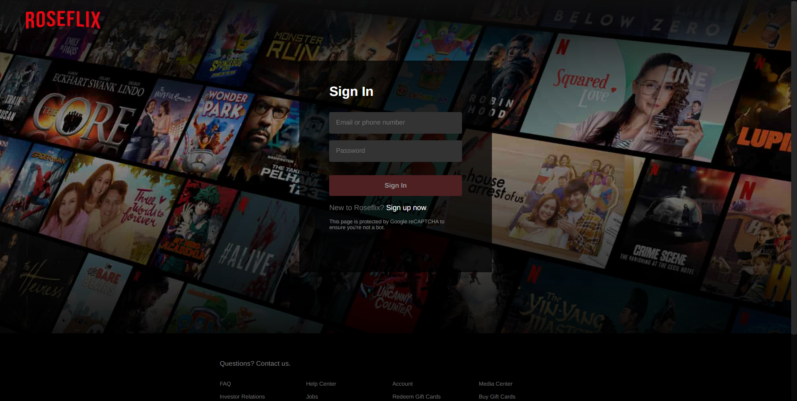
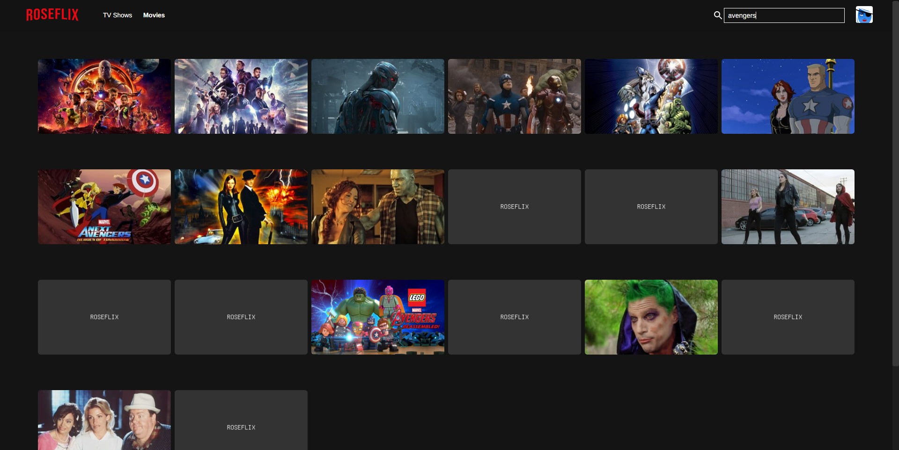
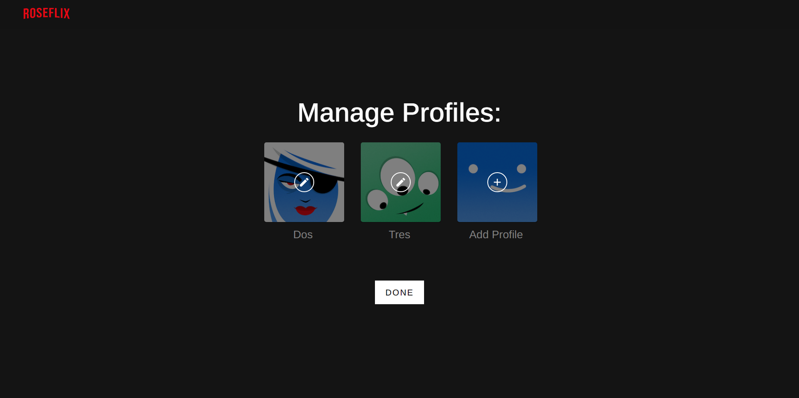
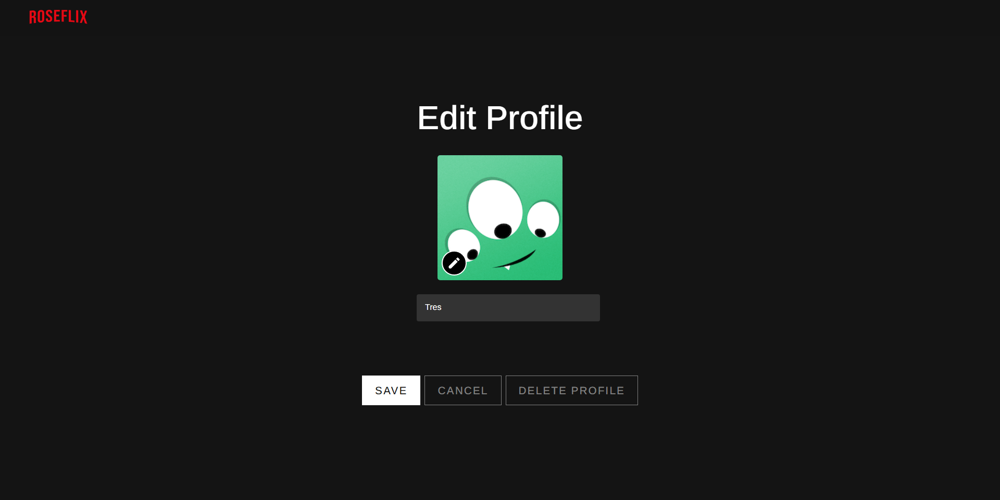
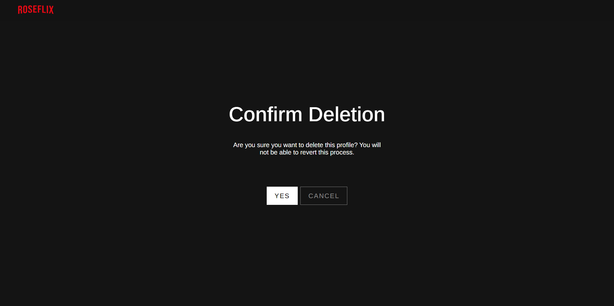

[![Netlify Status][netlify-shield]][netlify-url]
[![LinkedIn][linkedin-shield]][linkedin-url]


<br />
<p align="center">
  <h1 align="center">Roseflix: A Netflix Clone</h1>
  
  <p align="center">
    My React.js implementation of Netflix. Movie data was pulled from TMDB and trailer videos from Youtube.
    <br /><br />
    <a href="https://roseflix-rosebilag.vercel.app"><strong>View Demo »</strong></a>
    <br /><br />
    <a href="https://github.com/rosebilag/roseflix/issues">Report Bug</a>
    ·
    <a href="https://github.com/rosebilag/roseflix/issues">Request Feature</a>
  </p>
</p>


<h2 style="display: inline-block">Table of Contents</h2>
<ol>
  <li>
    <a href="#about-the-project">About The Project</a>
    <ul>
      <li><a href="#built-with">Built With</a></li>
    </ul>
  </li>
  <li>
    <a href="#getting-started">Getting Started</a>
    <ul>
      <li><a href="#prerequisites">Prerequisites</a></li>
      <li><a href="#installation">Installation</a></li>
    </ul>
  </li>
  <li><a href="#usage">Usage</a></li>
  <li><a href="#contact">Contact</a></li>
</ol>


## About The Project

### Built With
* **[React](https://reactjs.org/)**
* **[Typescript](https://www.typescriptlang.org/)**
* [Node.js](https://nodejs.org/en/)
* [MongoDB](https://www.mongodb.com/)


## Getting Started
To get a local copy up and running follow these simple steps.


### Prerequisites
Install latest version of npm
* npm
  ```sh
  npm install npm@latest -g
  ```

### Installation
1. Clone the project
   ```sh
   git clone https://github.com/rosebilag/roseflix.git
   ```
2. Go to project directory and Install NPM packages
   ```sh
   npm install
   ```
3. Create .env file 
4. Request an API key from TMDB and add it to your .env
   ```sh
   REACT_APP_API_KEY=xxxxxxxxxxxxxxxxxxxxxxxxxxxxxxxx
   ```
5. In a new directory, clone the backend and follow installation instructions on its README
   ```sh
   git clone https://github.com/rosebilag/roseflix-backend
   ```
6. You should now have the server running locally. Add the url to your .env
   ```sh
   REACT_APP_SERVER_URL=http://localhost:8080
   ```
7. Start the application
   ```sh
   npm start
   ```


## Usage
**Creating an Account**


1. Go to Sign Up page.
    - From the homepage, enter your email and click 'Get Started'.
    - From Sign In page, click the 'Sign up now' link below 'Sign In' button.
2. Input the necessary fields. Don't worry. It won't take long.
    - Both email and phone number has to be unique.
    - Display name will be used to autogenerate initial user profile.
3. You'll be redirected to the login page. Enter your newly created credentials.


**Logging In**


1. Go to Sign In page.
    - From the homepage, click 'Sign in' button.
    - From Sign Up page, click the 'Sign in now' link below 'Sign Up' button.
2. Input the necessary fields and proceed.
    - You can sign in using either email or phone number.


**Searching for a Show**


1. Log in and select a profile.
2. Click the appropriate tab for your search.
    - If searching for a movie, click 'Movies' tab in the header.
    - If searching for a series, click 'TV Shows' tab in the header.
3. Click the search icon on the header.
4. Input your search term and press enter.
5. To show all shows again, clear the search input and press enter.


**Adding User Profile**


1. Log in to your account.
2. Click 'Manage Profiles'.
3. Click 'Add Profile'.
    - You can only add up to 5 profiles for each account.
4. Click the pencil/edit icon and choose your preferred avatar.
5. Enter your preferred display name and click 'Save'.
    - You can't use avatars and names already used by other profiles in the same account.


**Editing User Profile**


1. Log in to your account.
2. Click 'Manage Profiles'.
3. Click the profile you wish to edit.
4. Modify the profile as you see fit and click 'Save'.


**Deleting User Profile**


1. Log in to your account.
2. Click 'Manage Profiles'.
3. Click the profile you wish to delete.
4. Click 'Delete Profile'.
5. Confirm deletion by clicking 'Yes'.


## Contact
Rose Bilag - [LinkedIn](https://www.linkedin.com/in/rosejoybilag) - hello@rosebilag.com

Project Link: [https://github.com/rosebilag/roseflix](https://github.com/rosebilag/roseflix)


[netlify-shield]: https://img.shields.io/netlify/e828caa4-db91-4c8f-b1af-1333523dba5f?style=for-the-badge
[netlify-url]:https://app.netlify.com/sites/roseflix/deploys
[linkedin-shield]: https://img.shields.io/badge/-LinkedIn-black.svg?style=for-the-badge&logo=linkedin&colorB=555
[linkedin-url]: https://www.linkedin.com/in/rosejoybilag